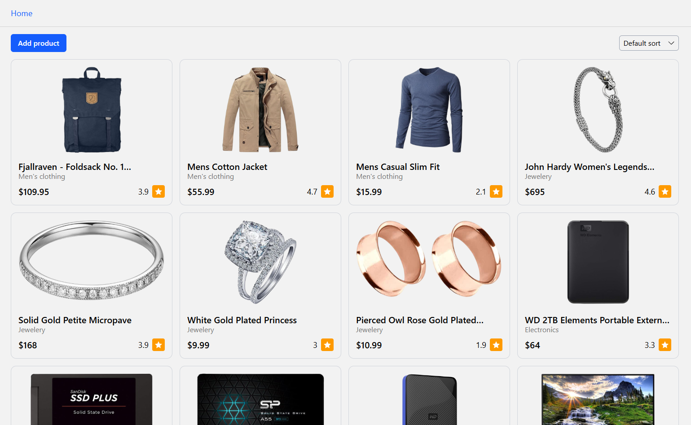

# 🛍️ Store Serivce (React + TypeScript)

**Store Service** is a single-page React + TypeScript application designed for viewing, sorting, adding, editing, and deleting products.

## 📷 Demo



## 🚀 Features

- 📋 View and sort products
- ➕ Add new products
- ✏️ View, edit and delete specific product

## 🧠 Tech Stack

| Category | Technologies |
|-----------|---------------|
| **Frontend** | React, TypeScript |
| **State Management** | Redux Toolkit (with RTK Query for caching and data fetching) |
| **Styling** | CSS / Tailwind |
| **HTTP Requests** | RTK Query or Fetch / Axios |

## ⚙️ Installation & Setup

### 1️⃣ Clone the repository
```bash
git clone https://github.com/acidless/store-service.git
cd store-service
```

### 2️⃣ Install dependencies
```bash
npm install
```

### 3️⃣ Start the development server
```bash
npm run dev
```

## 📝 License

This project is distributed under the MIT license.
